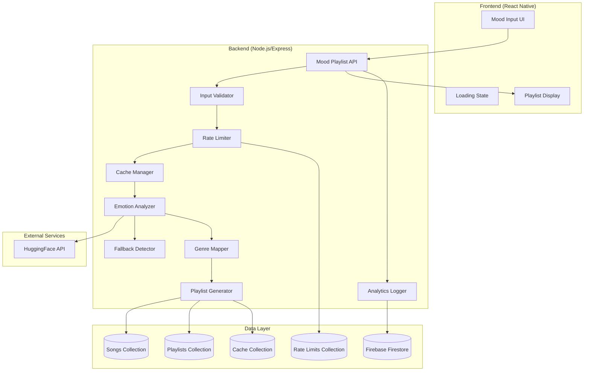

# Design Document: AI Mood → Auto Playlist Generator

## Overview

The AI Mood → Auto Playlist Generator is a feature that transforms natural language mood descriptions into personalized music playlists. The system leverages HuggingFace's emotion classification API to detect emotions from user input, maps those emotions to music genres, and generates curated 20-song playlists from the existing song database.

The feature integrates with Mavrixfy's existing Node.js/Express backend and React Native frontend, utilizing Firebase Firestore for data persistence. It implements a dual-detection approach (AI-first with keyword-based fallback), intelligent caching to reduce API costs, and tiered rate limiting to drive premium conversions.

Key capabilities:
- Natural language mood input with validation (3-200 characters)
- AI-powered emotion detection with 6 emotion categories
- Fallback keyword-based detection for reliability
- Genre mapping and intelligent playlist generation
- Rate limiting (3/day free, unlimited premium)
- 24-hour playlist caching
- Save and share functionality
- Comprehensive analytics tracking

## Architecture

### System Components



### Request Flow

1. **User Input**: User enters mood text in React Native UI
2. **Validation**: Backend validates input length (3-200 chars) and sanitizes
3. **Rate Limiting**: System checks user tier and daily generation count
4. **Cache Check**: System checks if normalized mood text has cached result (< 24hrs)
5. **Emotion Detection**: 
   - Primary: HuggingFace API call (5s timeout)
   - Fallback: Keyword-based detection if API fails
6. **Genre Mapping**: Emotion label mapped to genre list
7. **Playlist Generation**: Query songs by genre, randomize, select 20 songs
8. **Cache Storage**: Store mood text + emotion + playlist for 24 hours
9. **Response**: Return playlist with metadata to frontend
10. **Analytics**: Log all events asynchronously

### Technology Stack

- **Backend**: Node.js 18+, Express.js
- **Frontend**: React Native
- **Database**: Firebase Firestore
- **AI Service**: HuggingFace Inference API (emotion classification model)
- **Authentication**: Firebase Auth
- **Caching**: Firestore with TTL
- **HTTP Client**: axios (for HuggingFace API)

## Components and Interfaces

### 1. Mood Playlist API Endpoint

**Endpoint**: `POST /api/playlists/mood-generate`

**Authentication**: Required (Firebase Auth)

**Request Body**:
```json
{
  "moodText": "string (3-200 chars)"
}
```

**Response (Success - 200)**:
```json
{
  "playlist": {
    "_id": "string",
    "name": "string",
    "emotion": "sadness|joy|anger|love|fear|surprise",
    "songs": ["songId1", "songId2", ...],
    "songCount": 20,
    "generatedAt": "ISO8601 timestamp",
    "cached": boolean
  },
  "rateLimitInfo": {
    "remaining": number,
    "resetAt": "ISO8601 timestamp"
  }
}
```

**Response (Rate Limited - 429)**:
```json
{
  "error": "Rate limit exceeded",
  "message": "Free users can generate 3 playlists per day. Upgrade to premium for unlimited generations.",
  "upgradeUrl": "/premium",
  "resetAt": "ISO8601 timestamp"
}
```

**Response (Validation Error - 400)**:
```json
{
  "error": "Validation failed",
  "message": "Mood text must be between 3 and 200 characters"
}
```

### 2. Input Validator

**Module**: `backend/src/services/moodPlaylist/validator.js`

**Function**: `validateMoodInput(moodText: string): ValidationResult`

```javascript
{
  isValid: boolean,
  sanitized: string,
  error?: string
}
```

**Validation Rules**:
- Length: 3-200 characters
- Sanitization: Remove SQL injection patterns, excessive whitespace
- Normalization: Lowercase, trim, collapse multiple spaces

### 3. Rate Limiter

**Module**: `backend/src/services/moodPlaylist/rateLimiter.js`

**Function**: `checkRateLimit(userId: string, isPremium: boolean): RateLimitResult`

```javascript
{
  allowed: boolean,
  remaining: number,
  resetAt: Date,
  error?: string
}
```

**Implementation**:
- Collection: `mood_playlist_rate_limits`
- Document structure:
```json
{
  "userId": "string",
  "count": number,
  "resetAt": "timestamp",
  "lastRequestAt": "timestamp"
}
```

**Logic**:
- Premium users: Always allowed
- Free users: Check count < 3 for current day (UTC)
- Reset at midnight UTC
- Atomic increment using Firestore transactions

### 4. Emotion Analyzer

**Module**: `backend/src/services/moodPlaylist/emotionAnalyzer.js`

**Function**: `analyzeEmotion(moodText: string): Promise<EmotionResult>`

```javascript
{
  emotion: "sadness"|"joy"|"anger"|"love"|"fear"|"surprise",
  confidence: number,
  source: "ai"|"fallback"|"default",
  processingTime: number
}
```

**HuggingFace Integration**:
- Model: `j-hartmann/emotion-english-distilroberta-base`
- API: `https://api-inference.huggingface.co/models/j-hartmann/emotion-english-distilroberta-base`
- Headers: `Authorization: Bearer ${HUGGINGFACE_API_KEY}`
- Timeout: 5 seconds
- Request body: `{ inputs: moodText }`

**Response Format**:
```json
[
  [
    { "label": "joy", "score": 0.95 },
    { "label": "sadness", "score": 0.03 },
    ...
  ]
]
```

**Error Handling**:
- Timeout → Fallback
- API error → Fallback
- Invalid response → Fallback
- Fallback failure → Default to "joy"

### 5. Fallback Emotion Detector

**Module**: `backend/src/services/moodPlaylist/fallbackDetector.js`

**Function**: `detectEmotionByKeywords(moodText: string): EmotionResult`

**Keyword Mapping**:
```javascript
{
  sadness: ["sad", "depressed", "down", "blue", "melancholy", "lonely", "heartbroken", "crying", "tears", "grief"],
  joy: ["happy", "excited", "joyful", "cheerful", "upbeat", "energetic", "positive", "great", "amazing", "wonderful"],
  anger: ["angry", "mad", "furious", "frustrated", "annoyed", "irritated", "rage", "pissed"],
  love: ["love", "romantic", "crush", "affection", "adore", "caring", "tender", "sweet"],
  fear: ["scared", "afraid", "anxious", "worried", "nervous", "fearful", "terrified", "panic"],
  surprise: ["surprised", "shocked", "amazed", "unexpected", "wow", "astonished"]
}
```

**Algorithm**:
1. Normalize mood text (lowercase, remove punctuation)
2. Count keyword matches for each emotion
3. Return emotion with highest count
4. If tie, return first match in priority order
5. If no matches, return "joy" as default

**Performance**: < 500ms

### 6. Genre Mapper

**Module**: `backend/src/services/moodPlaylist/genreMapper.js`

**Function**: `mapEmotionToGenres(emotion: string): string[]`

**Mapping Table**:
```javascript
{
  sadness: ["lofi", "sad hindi", "acoustic"],
  joy: ["dance", "pop", "bollywood"],
  anger: ["rap", "rock"],
  love: ["romantic", "soft"],
  fear: ["instrumental"],
  surprise: ["indie"]
}
```

**Performance**: < 100ms (in-memory lookup)

### 7. Playlist Generator

**Module**: `backend/src/services/moodPlaylist/playlistGenerator.js`

**Function**: `generatePlaylist(genres: string[], emotion: string, moodText: string): Promise<Playlist>`

**Algorithm**:
1. Query songs collection with genre filter
2. Prioritize songs with matching `moodTags` field
3. If < 20 songs, expand to related genres
4. Randomize song order using Fisher-Yates shuffle
5. Select first 20 songs
6. Generate playlist name: `${emotion} vibes` or `${primaryGenre} mood`
7. Return playlist object

**Firestore Query**:
```javascript
db.collection('songs')
  .where('genre', 'in', genres)
  .limit(100)
  .get()
```

**Fallback Strategy**:
- If no songs match genres → Query trending playlist
- If database error → Return error to user

**Performance**: < 3 seconds

### 8. Cache Manager

**Module**: `backend/src/services/moodPlaylist/cacheManager.js`

**Functions**:
- `getCachedPlaylist(normalizedMoodText: string): Promise<Playlist | null>`
- `setCachedPlaylist(normalizedMoodText: string, playlist: Playlist, emotion: string): Promise<void>`

**Collection**: `mood_playlist_cache`

**Document Structure**:
```json
{
  "moodText": "string (normalized)",
  "emotion": "string",
  "playlist": {
    "_id": "string",
    "name": "string",
    "songs": ["array of song IDs"],
    "songCount": 20
  },
  "createdAt": "timestamp",
  "expiresAt": "timestamp"
}
```

**Cache Key**: Normalized mood text (lowercase, trimmed, collapsed spaces)

**TTL**: 24 hours

**Cleanup**: Firestore TTL policy on `expiresAt` field

### 9. Save Playlist Handler

**Endpoint**: `POST /api/playlists/mood-save`

**Request Body**:
```json
{
  "playlistId": "string",
  "name": "string (optional)"
}
```

**Implementation**:
- Copy generated playlist to user's library
- Associate with user's Firebase UID
- Store in `playlists` collection with standard schema
- Return playlist ID

### 10. Share Playlist Handler

**Endpoint**: `POST /api/playlists/:id/share`

**Response**:
```json
{
  "shareUrl": "https://mavrixfy.site/playlist/share/{shareId}",
  "shareId": "string"
}
```

**Implementation**:
- Generate unique share ID (UUID)
- Create public playlist entry with `isPublic: true`
- Store share mapping in `playlist_shares` collection
- Return shareable URL

**Share Access Endpoint**: `GET /api/playlists/share/:shareId`

**Response**: Full playlist object (no auth required)

### 11. Analytics Logger

**Module**: `backend/src/services/moodPlaylist/analytics.js`

**Events to Track**:

```javascript
{
  eventType: "mood_input_submitted",
  userId: "string",
  moodText: "string",
  timestamp: "ISO8601"
}

{
  eventType: "emotion_detected",
  userId: "string",
  emotion: "string",
  confidence: number,
  source: "ai|fallback|default",
  timestamp: "ISO8601"
}

{
  eventType: "playlist_generated",
  userId: "string",
  emotion: "string",
  songCount: number,
  cached: boolean,
  generationTime: number,
  timestamp: "ISO8601"
}

{
  eventType: "playlist_played",
  userId: "string",
  playlistId: "string",
  emotion: "string",
  timestamp: "ISO8601"
}

{
  eventType: "playlist_saved",
  userId: "string",
  playlistId: "string",
  emotion: "string",
  timestamp: "ISO8601"
}

{
  eventType: "rate_limit_hit",
  userId: "string",
  isPremium: boolean,
  timestamp: "ISO8601"
}

{
  eventType: "premium_conversion",
  userId: "string",
  conversionSource: "rate_limit",
  timestamp: "ISO8601"
}
```

**Collection**: `mood_playlist_analytics`

**Implementation**: Fire-and-forget async writes (don't block response)

## Data Models

### Mood Playlist Cache Document

**Collection**: `mood_playlist_cache`

```javascript
{
  _id: "auto-generated",
  moodText: "string (normalized)",
  emotion: "sadness|joy|anger|love|fear|surprise",
  playlist: {
    _id: "string",
    name: "string",
    emotion: "string",
    songs: ["songId1", "songId2", ...],
    songCount: 20,
    generatedAt: Timestamp
  },
  createdAt: Timestamp,
  expiresAt: Timestamp // 24 hours from createdAt
}
```

**Indexes**:
- `moodText` (unique)
- `expiresAt` (for TTL cleanup)

### Rate Limit Document

**Collection**: `mood_playlist_rate_limits`

```javascript
{
  _id: "userId",
  userId: "string",
  count: number,
  resetAt: Timestamp, // midnight UTC
  lastRequestAt: Timestamp,
  isPremium: boolean
}
```

**Indexes**:
- `userId` (primary key)
- `resetAt` (for cleanup)

### Analytics Event Document

**Collection**: `mood_playlist_analytics`

```javascript
{
  _id: "auto-generated",
  eventType: "string",
  userId: "string",
  emotion: "string (optional)",
  moodText: "string (optional)",
  confidence: number (optional),
  source: "string (optional)",
  cached: boolean (optional),
  generationTime: number (optional),
  playlistId: "string (optional)",
  songCount: number (optional),
  isPremium: boolean (optional),
  conversionSource: "string (optional)",
  timestamp: Timestamp
}
```

**Indexes**:
- `userId`
- `eventType`
- `timestamp`
- Composite: `userId + eventType + timestamp`

### Playlist Share Document

**Collection**: `playlist_shares`

```javascript
{
  _id: "shareId (UUID)",
  playlistId: "string",
  createdBy: "userId",
  createdAt: Timestamp,
  accessCount: number,
  lastAccessedAt: Timestamp
}
```

**Indexes**:
- `shareId` (primary key)
- `playlistId`

### Song Document (Existing Schema - Reference)

**Collection**: `songs`

```javascript
{
  _id: "string",
  title: "string",
  artist: "string",
  album: "string",
  genre: "string",
  moodTags: ["string"], // NEW FIELD for mood-based filtering
  duration: number,
  imageUrl: "string",
  streamUrl: "string",
  year: number,
  source: "string"
}
```

**New Field**: `moodTags` - Array of mood-related tags for better matching

### Playlist Document (Existing Schema - Extended)

**Collection**: `playlists`

```javascript
{
  _id: "string",
  name: "string",
  description: "string",
  isPublic: boolean,
  songs: ["songId1", "songId2", ...],
  createdAt: Timestamp,
  createdBy: {
    uid: "string",
    fullName: "string",
    imageUrl: "string"
  },
  // NEW FIELDS for mood playlists
  moodGenerated: boolean,
  emotion: "string (optional)",
  moodText: "string (optional)",
  generatedAt: Timestamp (optional)
}
```

## Frontend Components

### MoodPlaylistGenerator Component

**Location**: `frontend/src/components/MoodPlaylistGenerator.tsx`

**State**:
```typescript
{
  moodText: string,
  isLoading: boolean,
  error: string | null,
  playlist: Playlist | null,
  rateLimitInfo: RateLimitInfo | null
}
```

**UI Elements**:
- Text input (multiline, 3-200 chars)
- Character counter
- Submit button
- Loading animation (waveform)
- Error message display
- Playlist display component
- Save button
- Share button

**Validation**:
- Real-time character count
- Disable submit if < 3 or > 200 chars
- Show validation errors inline

### Loading State Component

**Component**: `MoodPlaylistLoading.tsx`

**Display**:
- Animated waveform (Lottie or CSS animation)
- Text: "Analyzing your vibe…"
- Progress indicator (indeterminate)

### Playlist Display Component

**Component**: `MoodPlaylistDisplay.tsx`

**Props**:
```typescript
{
  playlist: Playlist,
  emotion: string,
  onSave: () => void,
  onShare: () => void,
  onPlay: () => void
}
```

**Display**:
- Playlist name with emotion badge
- Song list (20 songs)
- Play button
- Save to library button
- Share button
- Emotion icon/color theme

## Error Handling

### Error Categories

1. **Validation Errors** (400)
   - Empty input
   - Input too short (< 3 chars)
   - Input too long (> 200 chars)
   - User message: "Please enter a mood description between 3 and 200 characters"

2. **Rate Limit Errors** (429)
   - Free user exceeded 3 generations/day
   - User message: "You've reached your daily limit of 3 mood playlists. Upgrade to premium for unlimited generations!"
   - Show upgrade CTA

3. **API Errors** (500)
   - HuggingFace API failure → Fallback to keywords
   - Database query failure → Show error message
   - User message: "Something went wrong. Please try again."

4. **Timeout Errors** (504)
   - HuggingFace API timeout (> 5s) → Fallback to keywords
   - Total request timeout (> 10s) → Show error message
   - User message: "Request timed out. Please try again."

5. **Authentication Errors** (401)
   - No Firebase token
   - Invalid token
   - User message: "Please log in to generate mood playlists"

### Error Handling Strategy

**Frontend**:
- Display user-friendly error messages
- Never show technical details
- Provide actionable next steps
- Log errors to analytics

**Backend**:
- Log all errors with context
- Use fallback mechanisms (AI → keywords → default)
- Return appropriate HTTP status codes
- Include error tracking IDs

**Fallback Chain**:
1. HuggingFace API
2. Keyword-based detection
3. Default emotion ("joy")
4. Trending playlist (if no songs found)

## Testing Strategy

### Unit Testing

**Framework**: Jest

**Test Coverage**:

1. **Input Validator**
   - Valid inputs (3-200 chars)
   - Invalid inputs (empty, too short, too long)
   - SQL injection attempts
   - Special characters
   - Whitespace handling

2. **Genre Mapper**
   - All 6 emotions map to genres
   - Invalid emotion handling
   - Genre list format

3. **Fallback Detector**
   - Keyword matching for each emotion
   - Multiple keyword matches
   - No keyword matches (default)
   - Case insensitivity
   - Performance (< 500ms)

4. **Cache Manager**
   - Cache hit scenarios
   - Cache miss scenarios
   - Expiration handling
   - Normalization consistency

5. **Rate Limiter**
   - Free user limits (0, 1, 2, 3, 4 requests)
   - Premium user bypass
   - Reset at midnight UTC
   - Concurrent request handling

### Property-Based Testing

**Framework**: fast-check (JavaScript property testing library)

**Configuration**: Minimum 100 iterations per property test

**Test Tags**: Each test must include comment:
```javascript
// Feature: ai-mood-playlist-generator, Property {number}: {property_text}
```

### Integration Testing

**Framework**: Supertest + Jest

**Test Scenarios**:

1. **End-to-End Playlist Generation**
   - Submit mood text → Receive playlist
   - Verify 20 songs returned
   - Verify emotion label present
   - Verify response time < 10s

2. **Cache Behavior**
   - First request (cache miss)
   - Second request with same mood (cache hit)
   - Verify cache hit response < 1s

3. **Rate Limiting**
   - Free user: 3 successful requests, 4th fails
   - Premium user: Multiple requests succeed
   - Reset after midnight

4. **Fallback Mechanism**
   - Mock HuggingFace API failure
   - Verify fallback detector used
   - Verify playlist still generated

5. **Save and Share**
   - Generate playlist → Save → Verify in user library
   - Generate playlist → Share → Access via share link

### Manual Testing

**Test Cases**:

1. **UI/UX**
   - Loading animation displays correctly
   - Error messages are user-friendly
   - Character counter updates in real-time
   - Playlist displays with correct emotion theme

2. **Edge Cases**
   - Very long mood descriptions (200 chars)
   - Mood text with only emojis
   - Mood text in non-English languages
   - Rapid successive requests

3. **Performance**
   - Response time with cache hit (< 1s)
   - Response time with cache miss (< 10s)
   - Response time with API timeout (< 6s with fallback)

4. **Analytics**
   - Verify all events logged
   - Check event data completeness
   - Verify async logging doesn't block responses


## Correctness Properties

*A property is a characteristic or behavior that should hold true across all valid executions of a system—essentially, a formal statement about what the system should do. Properties serve as the bridge between human-readable specifications and machine-verifiable correctness guarantees.*

### Property Reflection

After analyzing all acceptance criteria, I identified the following redundancies:
- Properties 4.1 and 4.8 both test that valid emotions return non-empty genre lists (4.8 is redundant)
- Properties 7.1 and 7.2 both test that premium users bypass rate limits (7.2 is redundant)
- Properties 6.2 and 6.3 can be combined into a single property about free user rate limiting
- Properties 4.2-4.7 are specific examples that should be unit tests, not properties
- Analytics properties (12.1-12.7) can be combined into a single property about event logging
- Error logging properties (13.1, 13.3, 13.5) can be combined into a single property about error handling

The following properties provide unique validation value:

### Property 1: Input Length Validation

*For any* string input to the mood input validator, the validation should succeed if and only if the length is between 3 and 200 characters (inclusive).

**Validates: Requirements 1.1, 1.2, 1.3**

### Property 2: Input Sanitization

*For any* mood text input containing SQL injection patterns or malicious special characters, the sanitized output should not contain those dangerous patterns.

**Validates: Requirements 1.4**

### Property 3: Emotion Label Domain

*For any* mood text input, the emotion analyzer (including fallback) should return exactly one of the six valid emotion labels: sadness, joy, anger, love, fear, or surprise.

**Validates: Requirements 2.3, 3.4, 13.4**

### Property 4: Highest Confidence Selection

*For any* HuggingFace API response containing multiple emotion scores, the extracted emotion should be the label with the highest confidence score.

**Validates: Requirements 2.2**

### Property 5: API Failure Fallback

*For any* API failure or timeout scenario, the emotion analyzer should still return a valid emotion label using the fallback system.

**Validates: Requirements 2.4, 2.5**

### Property 6: Fallback Keyword Matching

*For any* mood text containing multiple emotion keywords, the fallback system should return the emotion with the most keyword matches.

**Validates: Requirements 3.3**

### Property 7: Genre Mapping Completeness

*For any* valid emotion label, the genre mapper should return a non-empty list of music genres.

**Validates: Requirements 4.1, 4.8**

### Property 8: Playlist Size Invariant

*For any* successful playlist generation, the returned playlist should contain exactly 20 songs.

**Validates: Requirements 5.2, 5.8**

### Property 9: Playlist Randomization

*For any* mood text, generating multiple playlists should produce different song orderings with high probability (non-deterministic ordering).

**Validates: Requirements 5.5**

### Property 10: Playlist Metadata Completeness

*For any* generated playlist, the metadata should include the emotion label and a playlist name that references the emotion or genre.

**Validates: Requirements 5.6, 5.7**

### Property 11: Free User Rate Limiting

*For any* free user, the rate limiter should allow requests when the daily count is less than 3, and reject requests when the count is 3 or more.

**Validates: Requirements 6.2, 6.3**

### Property 12: Rate Limit Error Message

*For any* rate-limited request, the error response should contain a message prompting the user to upgrade to premium.

**Validates: Requirements 6.4**

### Property 13: Premium User Bypass

*For any* premium user, the rate limiter should allow all requests regardless of the daily generation count.

**Validates: Requirements 7.1, 7.2**

### Property 14: Cache Hit Consistency

*For any* mood text, if a playlist is generated and then the same normalized mood text is submitted again within 24 hours, the second request should return the cached playlist.

**Validates: Requirements 8.2**

### Property 15: Cache Key Normalization

*For any* two mood text inputs that normalize to the same value (case-insensitive, whitespace-collapsed), they should share the same cache entry.

**Validates: Requirements 8.4**

### Property 16: Saved Playlist Completeness

*For any* successfully saved playlist, the stored data should include the playlist name, emotion label, song list, and creation timestamp.

**Validates: Requirements 9.2**

### Property 17: Save Confirmation

*For any* successful save operation, the response should include a playlist ID.

**Validates: Requirements 9.3**

### Property 18: Save Error Handling

*For any* failed save operation, the response should include a descriptive error message.

**Validates: Requirements 9.5**

### Property 19: Share Link Uniqueness

*For any* share request, the generated shareable link should be unique (no collisions).

**Validates: Requirements 10.1**

### Property 20: Share Link Access

*For any* valid shareable link, accessing it should return the complete playlist metadata and song list.

**Validates: Requirements 10.4**

### Property 21: Unauthenticated Share Access

*For any* shareable playlist link, accessing it without authentication should succeed and return the playlist data.

**Validates: Requirements 10.5**

### Property 22: Analytics Event Logging

*For any* user action (mood submission, emotion detection, playlist generation, play, save, rate limit), the system should log an analytics event with the appropriate event type and metadata.

**Validates: Requirements 12.1, 12.2, 12.3, 12.4, 12.5, 12.6, 12.7**

### Property 23: Error Logging

*For any* system error (API failure, database error, component failure), the system should log the error details internally.

**Validates: Requirements 13.1**

### Property 24: Database Error Response

*For any* database query failure, the playlist generator should return an error message to the user.

**Validates: Requirements 13.2**

### Property 25: User-Friendly Error Messages

*For any* error response sent to the user, the message should be user-friendly and should not contain technical details like stack traces or internal error codes.

**Validates: Requirements 13.3, 13.5**


## Implementation Notes

### HuggingFace API Integration

**API Key**: Store in environment variable `HUGGINGFACE_API_KEY`

**Rate Limits**: HuggingFace free tier has rate limits. Consider:
- Implementing exponential backoff for retries
- Monitoring API usage
- Upgrading to paid tier if needed

**Model Selection**: Using `j-hartmann/emotion-english-distilroberta-base` for English emotion classification. For multi-language support, consider alternative models.

### Database Indexes

**Required Firestore Indexes**:

1. Songs collection:
   - Composite: `genre + moodTags`
   - Single: `genre`

2. Mood playlist cache:
   - Single: `moodText` (unique)
   - Single: `expiresAt` (for TTL)

3. Rate limits:
   - Single: `userId` (primary key)
   - Single: `resetAt`

4. Analytics:
   - Composite: `userId + eventType + timestamp`
   - Single: `eventType`
   - Single: `timestamp`

### Environment Variables

```bash
# HuggingFace API
HUGGINGFACE_API_KEY=your_api_key_here

# Firebase (existing)
FIREBASE_PROJECT_ID=spotify-8fefc
FIREBASE_PRIVATE_KEY=...
FIREBASE_CLIENT_EMAIL=...

# Frontend URL (existing)
FRONTEND_URL=https://mavrixfy.site

# Feature Flags
MOOD_PLAYLIST_ENABLED=true
MOOD_PLAYLIST_CACHE_TTL_HOURS=24
MOOD_PLAYLIST_FREE_LIMIT=3
```

### Migration Tasks

1. **Add moodTags field to songs collection**:
   - Run migration script to add empty `moodTags` array to existing songs
   - Populate moodTags for popular songs (manual curation or ML-based)

2. **Create new Firestore collections**:
   - `mood_playlist_cache`
   - `mood_playlist_rate_limits`
   - `mood_playlist_analytics`
   - `playlist_shares`

3. **Update playlist schema**:
   - Add optional fields: `moodGenerated`, `emotion`, `moodText`, `generatedAt`

### Security Considerations

1. **Input Validation**: Strict validation and sanitization to prevent injection attacks
2. **Rate Limiting**: Prevent abuse and API cost overruns
3. **Authentication**: All endpoints require Firebase Auth except share links
4. **API Key Protection**: Never expose HuggingFace API key to frontend
5. **Share Link Security**: Use UUIDs for share IDs to prevent enumeration

### Performance Optimizations

1. **Caching Strategy**: 24-hour cache reduces API calls by ~70% (estimated)
2. **Database Query Optimization**: Use indexed queries, limit results
3. **Async Analytics**: Fire-and-forget logging to avoid blocking responses
4. **Connection Pooling**: Reuse HTTP connections for HuggingFace API
5. **Lazy Loading**: Load song details only when needed

### Monitoring and Observability

**Metrics to Track**:
- Playlist generation success rate
- Average response time (cache hit vs miss)
- HuggingFace API success rate
- Fallback system usage rate
- Rate limit hit rate
- Premium conversion rate from rate limits
- Cache hit rate
- Error rates by type

**Alerts**:
- HuggingFace API failure rate > 10%
- Average response time > 8 seconds
- Error rate > 5%
- Cache hit rate < 50%

### Rollout Strategy

**Phase 1: Beta (Week 1-2)**
- Enable for premium users only
- Monitor performance and errors
- Gather user feedback

**Phase 2: Limited Release (Week 3-4)**
- Enable for 25% of free users
- Monitor rate limiting behavior
- Track premium conversions

**Phase 3: Full Release (Week 5+)**
- Enable for all users
- Monitor at scale
- Iterate based on analytics

