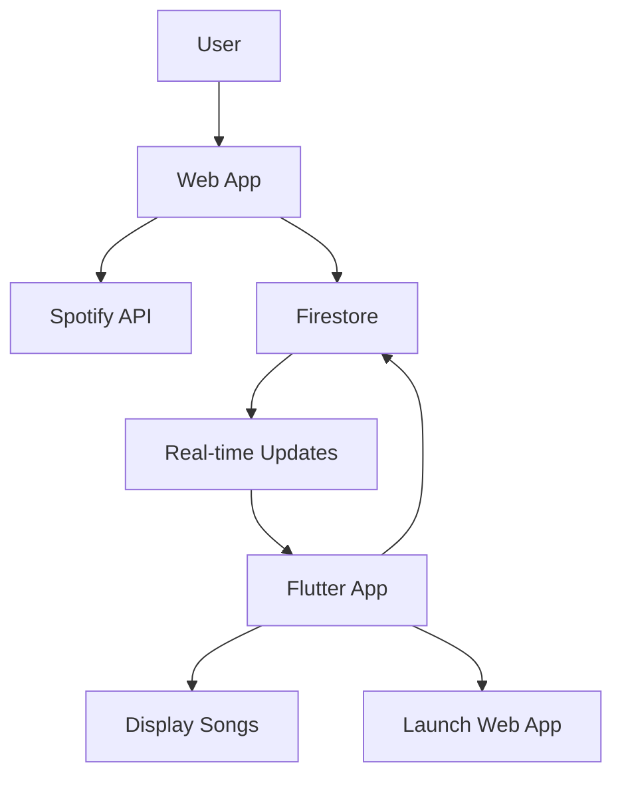

# Design Document: Flutter Spotify Display-Only Integration

## Overview

This design transforms the Flutter app's Spotify integration from a full-featured sync system to a display-only system. The web app will handle all Spotify authentication and syncing operations, while the Flutter app will only display synced songs from Firestore and provide guidance to users for managing their Spotify connection via the web app.

## Architecture

### Current Architecture (To Be Simplified)
```
Flutter App
├── Spotify OAuth Service
├── Spotify API Service  
├── Spotify Sync Service
├── Background Sync Service
├── Deep Link Service
└── Firestore Service (read/write)
```

### Target Architecture (Display-Only)
```
Flutter App
├── Spotify Status Service (read-only)
├── Firestore Service (read-only for Spotify data)
└── Web App Launcher Service

Web App (External)
├── Spotify OAuth Service
├── Spotify API Service
├── Spotify Sync Service
└── Firestore Service (write Spotify data)
```

### Data Flow


## Components and Interfaces

### 1. Spotify Status Service (Simplified)
**Purpose**: Read-only service to fetch Spotify connection status from Firestore

**Interface**:
```dart
class SpotifyStatusService {
  Future<Map<String, dynamic>> getSpotifyStatus();
  Stream<Map<String, dynamic>> watchSpotifyStatus();
  Future<void> launchWebApp();
}
```

**Data Structure**:
```dart
{
  'isConnected': bool,
  'lastSync': Timestamp?,
  'userProfile': {
    'display_name': String,
    'email': String,
    'id': String
  }?,
  'syncInProgress': bool,
  'totalSongs': int,
  'error': String?
}
```

### 2. Firestore Service (Read-Only for Spotify Data)
**Purpose**: Read liked songs and Spotify metadata from Firestore

**Interface**:
```dart
class FirestoreService {
  Future<List<SongModel>> getLikedSongs();
  Stream<List<SongModel>> watchLikedSongs();
  Future<Map<String, dynamic>> getSpotifyMetadata();
  Stream<Map<String, dynamic>> watchSpotifyMetadata();
}
```

### 3. Web App Launcher Service
**Purpose**: Launch web app for Spotify management

**Interface**:
```dart
class WebAppLauncherService {
  Future<void> launchSpotifyManagement();
  Future<void> launchWithDeepLink(String path);
}
```

### 4. Simplified Spotify Auth Page
**Purpose**: Display connection status and guide users to web app

**Components**:
- Connection status display
- Web app launch button
- Sync status information
- Clear messaging about web app workflow

## Data Models

### Song Model (Unchanged)
```dart
class SongModel {
  final String id;
  final String title;
  final String artist;
  final String album;
  final String imageUrl;
  final String audioUrl;
  final int duration;
  final bool isLiked;
  final String? source; // 'manual' or 'spotify'
  final DateTime? likedAt;
}
```

### Spotify Status Model
```dart
class SpotifyStatus {
  final bool isConnected;
  final DateTime? lastSync;
  final SpotifyUserProfile? userProfile;
  final bool syncInProgress;
  final int totalSongs;
  final String? error;
}

class SpotifyUserProfile {
  final String displayName;
  final String email;
  final String id;
}
```

## Correctness Properties

*A property is a characteristic or behavior that should hold true across all valid executions of a system-essentially, a formal statement about what the system should do. Properties serve as the bridge between human-readable specifications and machine-verifiable correctness guarantees.*
